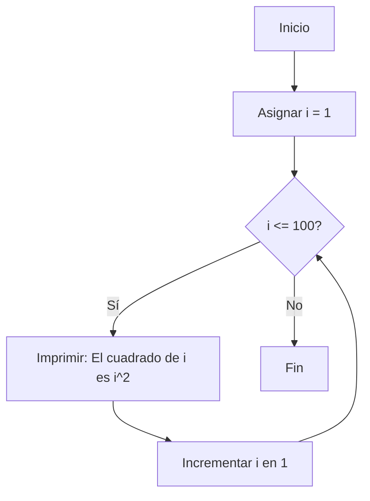
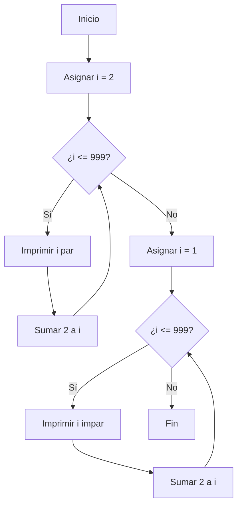
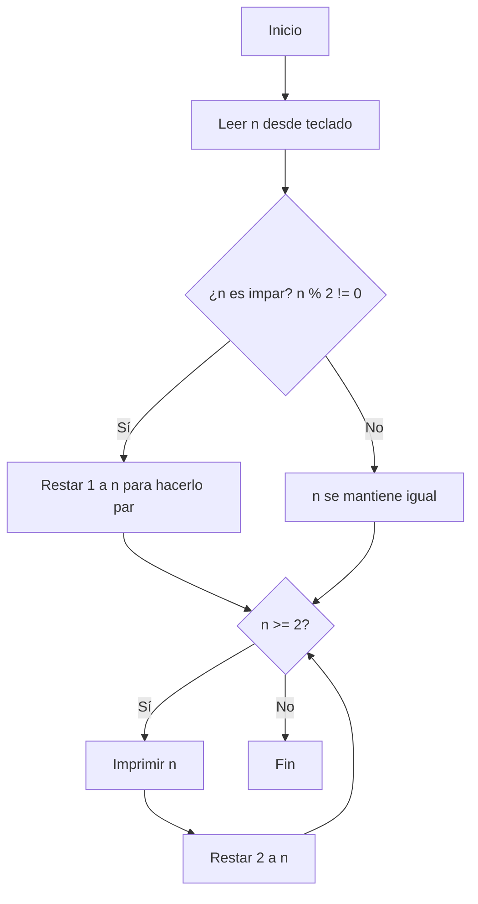

# Reto06
1- Imprimir un listado con los números del 1 al 100 cada uno con su respectivo cuadrado.

2- Imprimir un listado con los números impares desde 1 hasta 999 y seguidamente otro listado con los números pares desde 2 hasta 1000.

3- Imprimir los números pares en forma descendente hasta 2 que son menores o iguales a un número natural n ≥ 2 dado

4- Imprimir el factorial de un número natural n dado.

5- Implementar un programa que ingrese un número de 2 a 50 y muestre sus divisores.

6- Implementar el algoritmo que muestre los números primos del 1 al 100. Nota: use funciones.

## Ejercicio 1
```python
i = 1  #Aquí iniciamos con una varialble (i) igual a 1
while(i <= 100):   #En esta linea ponemos la condición de (mientras i sea menos o igual a 0)
  print("El cuadradao de " + str(i) + " es " + str(i**2) )   #Acá decimos que si se cumple la condición de arriba se imprima "El cuadradao de " + str(i) + " es " + str(i**2)
  i = i + 1   # Y acá actualizamos la i diciendole que ahora se sume uno, haciendo que recorra de 1 hasta 100
```



## Ejercicio 2
```python
n = int(input("ingrese un número menor que 2 ")) #Aca decimos que n es un valor entero que nosotros igresaremos 

if n % 2 != 0: #En esta linea decimo que si el modulo de n % 2 es diferente de 0 le restemos 1 para que nos de el par
    n = n - 1 #inmediatamente anterios. Así volvemos un impar en impar

while (n >= 2): #Aca emepzamos condicionando el bucle, si n es mayor o igual a 2 entramos al bucle
    print(n) #Si la condición anterior se cumple imprimimos n
    n = n - 2 # aca actualizamos n restandole dos para que nos de el par anterior
```



## Ejercicio 3
```python
n = int(input("ingrese un número menor que 2 ")) #Aca decimos que n es un valor entero que nosotros igresaremos 

if n % 2 != 0: #En esta linea decimo que si el modulo de n % 2 es diferente de 0 le restemos 1 para que nos de el par
    n = n - 1 #inmediatamente anterios. Así volvemos un impar en impar

while (n >= 2): #Aca emepzamos condicionando el bucle, si n es mayor o igual a 2 entramos al bucle
    print(n) #Si la condición anterior se cumple imprimimos n
    n = n - 2 # aca actualizamos n restandole dos para que nos de el par anterior
```



## Ejercicio 4
```python
n = int(input("ingrese un número: ")) # Se le pide que ingrese un número

facto = 1 #Una variable (facto) para guardar las multiplicaciones, la empezamos en 1 para que no afecte la multiplicación
i = n #Declaramos i igual a n para poder meterla en el bucle 

while (i >= 1): #Condicionamos a i para que sea mayor o igual a 1
    facto = facto * i #Vamos multiplicando i para acumular las multiplicaciones
    i = i - 1 #Vamos restando 1 a i para ir disminuyendo a que quede 1
print("El factorial de " + str(n) + " es " + str(facto)) #Imprimimos el factorial
```

## Ejercicio 5
```python
n = int(input("ingrese un número: ")) #Le pedimos que ingrese un número n

print("Los divisores de " + str(n) + " son:") #Imprimimos los divisores del número(n) son:

i = n #Declaramos que i es igual a n 
while (1 <= i <= n): #Dejamos a i en un rango de 1 a n
    if n % i == 0: # Si el modulo de n % i es 0 significa que es divisor
        print(i) # imprimimos el divisor
    i = i - 1    # restamos 1 a i que es igual a n para hacerlo hasta que llegue a 1 y evaluar si es o no divisor
```

## Ejercicio 6
```python
def es_primo(n: int) -> bool:

    #Comenzamos a dividir desde 2 hasta la raíz cuadrada de n
    i = 2
    while i * i <= n:
        #si n es divisible por algún número entre 2 y raíz de n, no es primo
        if n % i == 0:
            return False
        i += 1  #Se le suma 1 a i para probar el siguiente posible divisor

    return True #si no se encontró ningún divisor n es primo

def mostrar_primos_hasta_100():
    print("Números primos del 1 al 100:")

    i = 1  # Comenzamos desde 1 (aunque 1 no es primo, se verificará en la función)
    while i <= 100:
        if es_primo(i):  #Llamamos a la función para verificar si i es primo
            print(i)     #Si es primo, lo mostramos por pantalla
        i += 1           #Incrementamos para probar el siguiente número


if __name__ == "__main__": #función main
    mostrar_primos_hasta_100()  #Llamamos a la función principal para mostrar los primos
```
